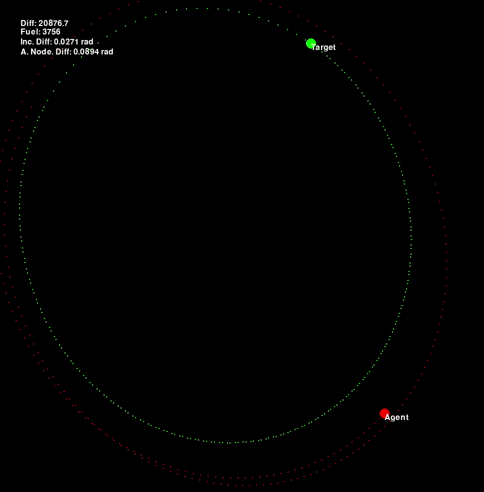
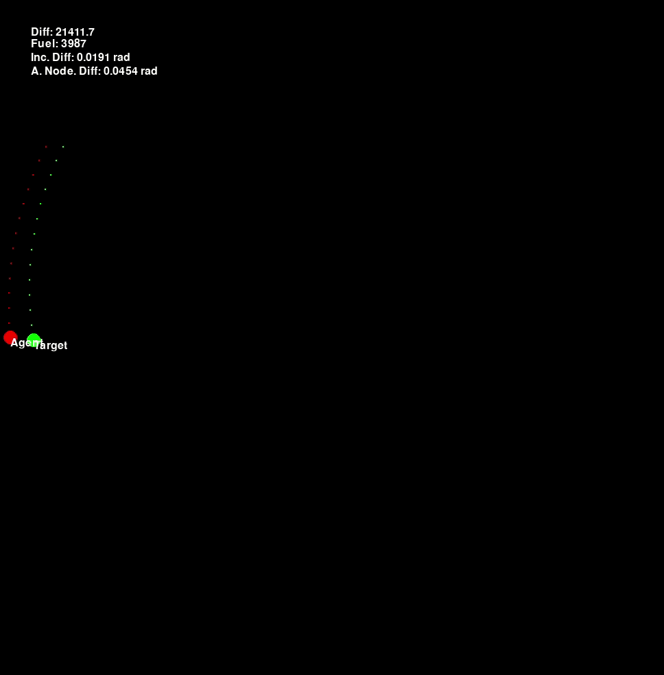

# Spaceship rendezvous  with Reinforcement Learning

<b>Description:</b> The agent, a spaceship orbiting the Earth, wants to make a rendezvous with a target spaceship. The agent has limited fuel. It will try to use it up to get its orbit as close as possible to the target's orbit.  
 
## The Environment

Made with PyGame and <a href="https://github.com/poliastro/poliastro">Poliastro</a>. 

Steps of 1 minute 
Action in each step is a change in the velocity vector $dv=[x,y,z]$ where $x,y,z\in[-10,10]$. 
The game ends when:
<ul>
    <li>The agent runs out of fuel</li>
    <li>The agent crashed into the earth</li>
    <li>The agent orbit is <i>perfectly</i>(with certain error margin) alinged to the targets one.</li>
</ul>
An orbit can be described by the following six parameters:  
<ul>
    <li>Semi-major axis, $a$</li>
    <li>Eccentricity, $e$</li>
    <li>Inclination, $i$</li>
    <li>Argument of perigee, $\omega$</li>
    <li>Ascending node, $\Omega$</li>
    <li>True anomaly, $\upsilon$</li>
</ul>
The <b>orbits difference</b> is measured as the sum of the distances between apogees and perigees.

The <b>reward system</b> gives one point when the orbit gets closer to the target's orbit and minus one when it gets further from it. 

## Proximal Policy Optimization algorithm (PPO)

Before and after training: 

